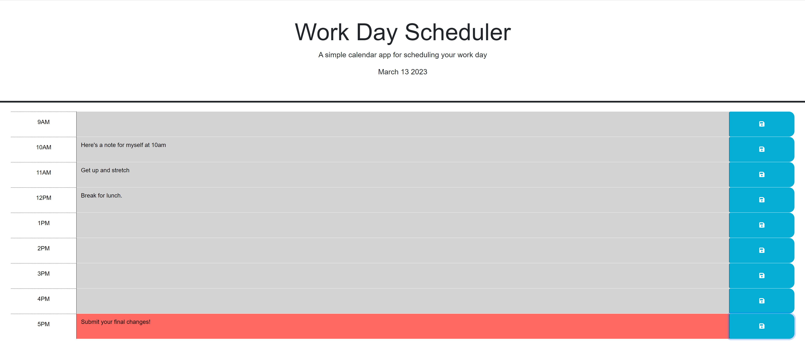

# Work-Day-Planner

  

## Description 

A simple application to leave notes in timeslots throughout the workday.

## Table of Contents

 - [Mockup](#Mockup)
 - [Installation](#Installation)
 - [Deployment](#Deployment)
 - [Usage](#Usage)
 - [Questions](#Questions)

## Mockup

## Installation

The Dayjs npm package was used for this application.
To use this, simply navigate to your working directory in the command line and type `npm install dayjs`.

## Deployment 

This application can be viewed in the browser if you clone this repository, but it is also being hosted on Github Pages: https://Christoph551.github.io/Work-Day-Planner

## Usage 

Leave yourself helpful notes throughout a 9-5 workday! Simply open the application in your browser where you will see a 9-5 timeblock laid out. 

The dayjs npm package tracks the current time and JavaScript has been implemented to keep track of when a note was left. Grey blocks are past, green are future time blocks while red will indicate the current hour.